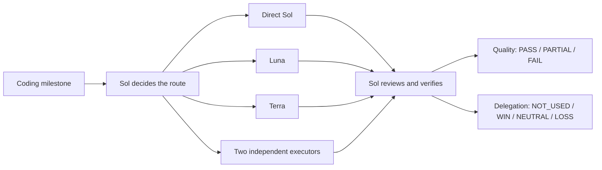

<a id="english"></a>

# Sol Mission Control

Make delegation earn its keep.

[](LICENSE)
[](sol-hybrid-delivery/SKILL.md)
[](sol-hybrid-delivery/SKILL.md)

English | [简体中文](#简体中文)

Many multi-agent coding setups treat "two agents started" as a result. It is not. That only proves the agents ran. It says nothing about code quality, elapsed time, token use, or the cleanup left for the primary model.

Sol Mission Control routes one coding milestone to Direct Sol, Luna, Terra, or one conflict-free pair. It then audits the finished task and the delegation separately. If Sol has to rescue the implementation, the task can pass while the delegation still loses. That distinction is the reason this project exists.

This repository packages the workflow as a Codex Skill named `$sol-hybrid-delivery`.



## What it does

- Keeps Direct Sol as the default. Delegation needs a clear reason.
- Sends exact, repetitive work to Luna.
- Sends bounded logic, fixes, tests, and local refactors to Terra.
- Allows at most one wave and two write-capable child agents.
- Gives every writer an exclusive file lease and rejects shared mutable state.
- Lets Sol take over automatically when a child fails or stops being useful.
- Records quality and delegation value on separate axes.

There are no availability scouts, no follow-up loops, and no request for the user to approve an internal model switch. Live services, production databases, deployment, hardware, browser state, credentials, and other external operations stay with Sol and their real authority checks.

## Routing in plain terms

| Work | Route |
| --- | --- |
| Small change, unclear behavior, tight integration, live state, deployment, or device work | Direct Sol |
| Exact bulk edits with deterministic output | `luna_fast` |
| Repetitive implementation with frozen semantics and a strong oracle | `luna_executor` |
| Small low-risk change that still needs judgment | `terra_fast` |
| Bounded bug fix, test, local refactor, or edge-case logic | `terra_executor` |

Two executors run only when their files, interfaces, fixtures, commands, generated artifacts, caches, and final checks are independent. The conservative target is at least 30% less wall-clock time after preparation and review. If that case cannot be made, Sol does the work directly.

## Install

The current installer targets Codex on Windows and also works from PowerShell 7 where the same Codex directory layout is available.

```powershell
git clone https://github.com/witalker/sol-mission-control.git
cd sol-mission-control
powershell -ExecutionPolicy Bypass -File .\sol-hybrid-delivery\scripts\install.ps1 -Force
```

Restart Codex App after installation so it reloads the Skill and agent profiles. For this workflow, use GPT-5.6 Sol as the parent model. The project recommends Max reasoning when delivery quality matters more than latency.

The Skill does not trigger implicitly. Call it by name:

```text
$sol-hybrid-delivery Complete this task with quality first. Continue through local implementation and verification.
```

For a longer task:

```text
$sol-hybrid-delivery Continue until this task is locally implemented and verified: <goal>. Let Sol choose Direct Sol, Luna, or Terra. Use at most one conflict-free wave with two writers. If delegation fails, let Sol finish within the existing authority.
```

In Plan mode:

```text
$sol-hybrid-delivery Plan only: <goal>. Return the route, write leases, acceptance oracle, and at most two frozen packets. Do not edit files or start child agents.
```

## Audit a run

Every implementation milestone writes `start`, `decision`, and `end` markers. Run the auditor with the parent task ID, every child task ID, and an optional comparable Direct Sol baseline:

```powershell
powershell -ExecutionPolicy Bypass -File .\sol-hybrid-delivery\scripts\audit-session-usage.ps1 `
  -SessionId <parent-id>,<child-id>,<optional-baseline-id> `
  -MilestoneId <optional-milestone-id>
```

Read these two fields first:

- `QualityOutcomeCalculated` says whether the requested behavior was accepted.
- `DelegationOutcomeCalculated` says whether the model split helped.

`WIN` requires a comparable measured or historical Direct Sol run. An estimate can guide routing, but it cannot prove savings.

## Run the tests

```powershell
powershell -ExecutionPolicy Bypass -File .\sol-hybrid-delivery\scripts\test-skill-contract.ps1
powershell -ExecutionPolicy Bypass -File .\sol-hybrid-delivery\scripts\test-audit-session-usage.ps1
powershell -ExecutionPolicy Bypass -File .\sol-hybrid-delivery\scripts\test-install.ps1
```

The regression set covers Direct Sol, Luna, Terra, a mixed two-agent wave, Sol fallback, model/profile mismatch, real versus incidental error text, incomplete audit markers, clean installation, and forced upgrades.

## Repository layout

```text
sol-hybrid-delivery/
  SKILL.md
  agents/openai.yaml
  assets/agent-profiles/
  references/
    model-routing.md
    audit-schema.md
    usage.md
  scripts/
    install.ps1
    audit-session-usage.ps1
    test-skill-contract.ps1
    test-audit-session-usage.ps1
    test-install.ps1
```

## Current limits

Version 1.0 has deterministic and synthetic regression coverage. It does not promise lower cost or faster delivery on every repository. Use the audit data from several real tasks before changing the routing thresholds.

Model and role availability still depends on the Codex App build and the models enabled for the account. This is a community project and is not affiliated with or endorsed by OpenAI.

Released under the [MIT License](LICENSE).

<a id="简体中文"></a>

## 简体中文

让每一次委派都拿出证据。

很多多代理方案把“成功拉起两个子代理”当成绩。其实这只能证明代理启动了，不能证明代码更好、任务更快、Token 更少，也看不出主模型最后替它们收拾了多少工作。

Sol Mission Control 会给一个编码里程碑选一条路：Sol 直接做，Luna 处理确定性的重复工作，Terra 处理边界明确的逻辑实现，或者让两个互不冲突的执行器并行。任务结束后，质量和委派收益分开计算。即使 Sol 最后把任务救了回来，质量可以是 `PASS`，这次委派仍然会记为 `LOSS`。这个区分就是项目存在的理由。

仓库里提供的是 Codex Skill：`$sol-hybrid-delivery`。

## 它具体做什么

- 默认让 Sol 直接完成。没有明确收益就不拆任务。
- 大量确定性修改交给 Luna。
- 局部逻辑、Bug 修复、测试和本地重构交给 Terra。
- 一个里程碑最多启动一波、两个可写子代理。
- 每个写代理都有独占文件范围，碰到共享状态就改为串行。
- 子代理失败或继续协调已经不划算时，Sol 在原授权范围内直接接手。
- 最终结果分成任务质量和委派收益两个数字，不再用“任务做完了”掩盖低效协作。

这个流程不用可用性 scout，不追加 `followup_task`，也不会为了 Sol 接管再向用户要一次内部模型切换授权。线上服务、真实数据库、部署、硬件、浏览器状态、凭据等操作仍由 Sol 处理，并保留原本该有的权限确认。

## 怎么选模型

| 任务形态 | 处理方式 |
| --- | --- |
| 小改动、需求含糊、强集成、线上状态、部署或设备操作 | Direct Sol |
| 输出完全确定的批量修改 | `luna_fast` |
| 语义冻结且有强验收标准的重复实现 | `luna_executor` |
| 风险较低但仍需要一点判断的小改动 | `terra_fast` |
| 有测试约束的局部修复、补测、重构或边界逻辑 | `terra_executor` |

只有两个任务的文件、接口、fixture、命令、生成物、缓存和最终验收互不影响时，才允许双代理并行。扣掉 Sol 的准备和复核时间后，保守估计至少应缩短 30% 的总耗时。达不到就让 Sol 自己做。

## 安装

安装器目前主要面向 Windows Codex。如果 PowerShell 7 所在环境使用同样的 Codex 目录结构，也可以直接运行。

```powershell
git clone https://github.com/witalker/sol-mission-control.git
cd sol-mission-control
powershell -ExecutionPolicy Bypass -File .\sol-hybrid-delivery\scripts\install.ps1 -Force
```

安装后重启 Codex App，让它重新加载 Skill 和代理配置。父任务选择 GPT-5.6 Sol。这个项目把效果放在第一位，质量要求高时建议使用 Max 推理强度。

Skill 默认不会隐式触发，需要明确写出名字：

```text
$sol-hybrid-delivery 完成这个任务，效果优先，持续做到本地实现和验证完成。
```

长任务可以这样写：

```text
$sol-hybrid-delivery 持续完成：<目标>。由 Sol 自主选择 Direct Sol、Luna 或 Terra；最多一波、两个无冲突写代理。子代理失败时由 Sol 在现有授权内自动接管，不要停下来询问模型切换权限。
```

Plan 模式：

```text
$sol-hybrid-delivery 只规划：<目标>。输出路由、写入范围、验收标准和最多两个冻结任务包；不执行、不修改、不启动子代理。
```

## 审计一次任务

每个实现里程碑会留下 `start`、`decision`、`end` 三段标记。把父任务 ID、全部子任务 ID 和可选的 Direct Sol 对照任务交给审计脚本：

```powershell
powershell -ExecutionPolicy Bypass -File .\sol-hybrid-delivery\scripts\audit-session-usage.ps1 `
  -SessionId <父任务ID>,<子任务ID>,<可选基线ID> `
  -MilestoneId <可选里程碑ID>
```

先看两个字段：

- `QualityOutcomeCalculated`：需求有没有通过验收。
- `DelegationOutcomeCalculated`：拆给子模型到底值不值。

只有存在可比的 Direct Sol 实测或历史任务时，审计器才会给出 `WIN`。预估可以帮助选路，但不能用来证明节省。

## 运行测试

```powershell
powershell -ExecutionPolicy Bypass -File .\sol-hybrid-delivery\scripts\test-skill-contract.ps1
powershell -ExecutionPolicy Bypass -File .\sol-hybrid-delivery\scripts\test-audit-session-usage.ps1
powershell -ExecutionPolicy Bypass -File .\sol-hybrid-delivery\scripts\test-install.ps1
```

回归场景包括 Direct Sol、Luna、Terra、Luna 和 Terra 双代理、Sol 接管、模型映射错误、真实错误与普通文本中的错误字样、审计标记缺失、首次安装和强制升级。

## 当前边界

v1.0 已经通过确定性测试和合成场景回归，但它不会保证每个仓库都更快、更省。先跑几次真实任务，看审计结果，再决定是否调整路由阈值。

模型和代理角色是否可用，仍取决于 Codex App 版本以及账户开放的模型。本项目由社区维护，与 OpenAI 没有隶属或背书关系。

项目采用 [MIT License](LICENSE)。
