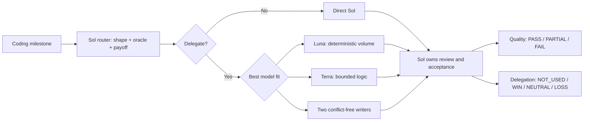

<a id="english"></a>

# Codex Sol Mission Control

Smart model routing for faster coding with fewer tokens.

[](LICENSE)
[](sol-hybrid-delivery/SKILL.md)
[](sol-hybrid-delivery/SKILL.md)

English | [简体中文](#简体中文)

Codex Sol Mission Control is a quality-first model router for Codex, built to shorten coding time and reduce token use. For each coding milestone, Sol chooses Direct Sol, Luna, Terra, or one conflict-free pair. The route follows the shape of the work, existing acceptance evidence, conflict risk, and the expected savings in time and tokens.

Sol keeps discovery, architecture, integration, and rescue. Luna takes deterministic repetition and bulk edits. Terra handles bounded logic, tests, and local refactors. Sol's context and high-reasoning budget stay focused on the work that needs them.

Task length alone never starts a child. The router checks the oracle, repository, exact write lease, expected diff, targeted validation, and coordination cost first. If preparation and review erase the expected time or token gain, the work stays with Sol.

Each milestone gets one wave and at most two writers. A two-agent wave needs independent files, interfaces, fixtures, commands, caches, and final checks, plus at least 30% projected critical-path gain. If a child fails, Sol finishes the packet. There is no retry swarm and no second request for permission to change the internal model.

The audit gives two separate verdicts: did the requested behavior pass, and did delegation help? A task can finish `PASS` while delegation is `LOSS`. To earn `WIN`, the run needs a comparable Direct Sol baseline and at least 15% measured savings in elapsed time or cost-sensitive token use, with coordination and rework still inside the protocol limits. Agent count and green tests are never enough.

The workflow is packaged as the Codex Skill `$sol-hybrid-delivery`.



## What the router enforces

| Rule | Consequence |
| --- | --- |
| Direct Sol is the default | Delegation needs an independent oracle, a frozen packet, an exact lease, and expected savings in time or token use. |
| Work shape chooses the model | Luna handles exact repetition. Terra handles bounded judgment. Sol keeps discovery, architecture, integration, and rescue. |
| Parallel writers cannot share mutable state | Shared files, contracts, fixtures, commands, caches, ports, or final checks force serial execution. |
| Child failure ends delegation for that packet | Sol takes over immediately. The workflow does not spend another invocation on a replacement child. |
| Quality and delegation are scored separately | Sol can save the task without allowing the failed handoff to claim a win. |

Availability scouts and follow-up loops are deliberately excluded. Live services, production databases, deployment, hardware, browser state, credentials, and other external operations stay with Sol and keep their real authority checks.

## Routing in plain terms

| Work | Route |
| --- | --- |
| Small change, unclear behavior, tight integration, live state, deployment, or device work | Direct Sol |
| Exact bulk edits with deterministic output | `luna_fast` |
| Repetitive implementation with frozen semantics and a strong oracle | `luna_executor` |
| Small low-risk change that still needs judgment | `terra_fast` |
| Bounded bug fix, test, local refactor, or edge-case logic | `terra_executor` |

Two executors run only when their files, interfaces, fixtures, commands, generated artifacts, caches, and final checks are independent. The conservative target is at least 30% less wall-clock time after preparation and review. If that case cannot be made, Sol does the work directly.

## Install

The current installer targets Codex on Windows and also works from PowerShell 7 where the same Codex directory layout is available.

```powershell
git clone https://github.com/witalker/sol-mission-control.git
cd sol-mission-control
powershell -ExecutionPolicy Bypass -File .\sol-hybrid-delivery\scripts\install.ps1 -Force
```

Restart Codex App after installation so it reloads the Skill and agent profiles. For this workflow, use GPT-5.6 Sol as the parent model. The project recommends Max reasoning when delivery quality matters more than latency.

The Skill does not trigger implicitly. Call it by name:

```text
$sol-hybrid-delivery Complete this task with quality first. Continue through local implementation and verification.
```

For a longer task:

```text
$sol-hybrid-delivery Continue until this task is locally implemented and verified: <goal>. Let Sol choose Direct Sol, Luna, or Terra. Use at most one conflict-free wave with two writers. If delegation fails, let Sol finish within the existing authority.
```

In Plan mode:

```text
$sol-hybrid-delivery Plan only: <goal>. Return the route, write leases, acceptance oracle, and at most two frozen packets. Do not edit files or start child agents.
```

## Audit a run

Every implementation milestone writes `start`, `decision`, and `end` markers. Run the auditor with the parent task ID, every child task ID, and an optional comparable Direct Sol baseline:

```powershell
powershell -ExecutionPolicy Bypass -File .\sol-hybrid-delivery\scripts\audit-session-usage.ps1 `
  -SessionId <parent-id>,<child-id>,<optional-baseline-id> `
  -MilestoneId <optional-milestone-id>
```

Read these two fields first:

- `QualityOutcomeCalculated` says whether the requested behavior was accepted.
- `DelegationOutcomeCalculated` says whether the model split helped.

`WIN` requires a comparable measured or historical Direct Sol run. An estimate can guide routing, but it cannot prove savings.

## Run the tests

```powershell
powershell -ExecutionPolicy Bypass -File .\sol-hybrid-delivery\scripts\test-skill-contract.ps1
powershell -ExecutionPolicy Bypass -File .\sol-hybrid-delivery\scripts\test-audit-session-usage.ps1
powershell -ExecutionPolicy Bypass -File .\sol-hybrid-delivery\scripts\test-install.ps1
```

The regression set covers Direct Sol, Luna, Terra, a mixed two-agent wave, Sol fallback, model/profile mismatch, real versus incidental error text, incomplete audit markers, clean installation, and forced upgrades.

## Repository layout

```text
sol-hybrid-delivery/
  SKILL.md
  agents/openai.yaml
  assets/agent-profiles/
  references/
    model-routing.md
    audit-schema.md
    usage.md
  scripts/
    install.ps1
    audit-session-usage.ps1
    test-skill-contract.ps1
    test-audit-session-usage.ps1
    test-install.ps1
```

## Current limits

Version 1.0 has deterministic and synthetic regression coverage. It does not promise lower cost or faster delivery on every repository. Use the audit data from several real tasks before changing the routing thresholds.

Model and role availability still depends on the Codex App build and the models enabled for the account. This is a community project and is not affiliated with or endorsed by OpenAI.

Released under the [MIT License](LICENSE).

<a id="简体中文"></a>

## 简体中文

智能模型路由，让编码更快，Token 花得更少。

Codex Sol Mission Control 是 Codex 的质量优先模型路由器，目标是在保证验收质量的前提下，缩短编码时间并减少 Token 消耗。每个编码里程碑先由 Sol 判断：自己做、交给 Luna、交给 Terra，或者拆成两个互不冲突的任务。选路依据是任务形态、现成验收证据、冲突风险，以及预计能省下多少时间和 Token。

Sol 负责探索、架构、集成和接管。Luna 承接确定性的重复工作和批量修改，Terra 处理边界明确的逻辑、测试与局部重构。Sol 的上下文和高强度推理预算因此留给难题。

任务长，不会自动触发子代理。路由器会先检查验收依据、仓库、精确写入范围、预计改动、定向测试和协调成本。准备与复核会吃掉预期的时间或 Token 收益时，任务仍由 Sol 直接完成。

一个里程碑只跑一波，最多两个写代理。双代理的文件、接口、fixture、命令、缓存和最终验收必须完全独立，扣掉 Sol 的准备与复核后，预估关键路径耗时至少缩短 30%。子代理失败后，Sol 直接完成剩余工作，不再换一个子代理重试，也不会让用户再次批准内部模型切换。

审计最后给出两个判定：需求有没有通过，委派到底值不值。任务可以是 `PASS`，委派同时是 `LOSS`。只有可比的 Direct Sol 基线证明实测总耗时或成本敏感 Token 用量至少下降 15%，而且协调和返工没有超限，才会记为 `WIN`。启动了几个代理、测试是不是绿色，都不能单独证明收益。

这套流程打包为 Codex Skill：`$sol-hybrid-delivery`。

## 模型路由的硬规则

| 规则 | 结果 |
| --- | --- |
| 默认由 Sol 直接完成 | 子代理必须有独立验收依据、冻结任务包、精确写入范围，以及可预期的时间或 Token 收益。 |
| 按任务形态选模型 | Luna 做确定性重复工作，Terra 做局部逻辑，Sol 负责探索、架构、集成和接管。 |
| 并行写入不能共享可变状态 | 文件、契约、fixture、命令、缓存、端口或最终验收有任何交叉，就改成串行。 |
| 子代理失败就关闭这次委派 | Sol 立即接手，不再浪费一次调用去启动替补子代理。 |
| 任务质量和委派收益分开算 | Sol 可以把任务救回来，但失败的委派不能顺便领走功劳。 |

流程不启动可用性 scout，也不追加 `followup_task`。线上服务、真实数据库、部署、硬件、浏览器状态和凭据仍由 Sol 处理，该有的权限确认照常保留。

## 怎么选模型

| 任务形态 | 处理方式 |
| --- | --- |
| 小改动、需求含糊、强集成、线上状态、部署或设备操作 | Direct Sol |
| 输出完全确定的批量修改 | `luna_fast` |
| 语义冻结且有强验收标准的重复实现 | `luna_executor` |
| 风险较低但仍需要一点判断的小改动 | `terra_fast` |
| 有测试约束的局部修复、补测、重构或边界逻辑 | `terra_executor` |

只有两个任务的文件、接口、fixture、命令、生成物、缓存和最终验收互不影响时，才允许双代理并行。扣掉 Sol 的准备和复核时间后，保守估计至少应缩短 30% 的关键路径耗时。达不到就让 Sol 自己做。

## 安装

安装器目前主要面向 Windows Codex。如果 PowerShell 7 所在环境使用同样的 Codex 目录结构，也可以直接运行。

```powershell
git clone https://github.com/witalker/sol-mission-control.git
cd sol-mission-control
powershell -ExecutionPolicy Bypass -File .\sol-hybrid-delivery\scripts\install.ps1 -Force
```

安装后重启 Codex App，让它重新加载 Skill 和代理配置。父任务选择 GPT-5.6 Sol。这个项目把效果放在第一位，质量要求高时建议使用 Max 推理强度。

Skill 默认不会隐式触发，需要明确写出名字：

```text
$sol-hybrid-delivery 完成这个任务，效果优先，持续做到本地实现和验证完成。
```

长任务可以这样写：

```text
$sol-hybrid-delivery 持续完成：<目标>。由 Sol 自主选择 Direct Sol、Luna 或 Terra；最多一波、两个无冲突写代理。子代理失败时由 Sol 在现有授权内自动接管，不要停下来询问模型切换权限。
```

Plan 模式：

```text
$sol-hybrid-delivery 只规划：<目标>。输出路由、写入范围、验收标准和最多两个冻结任务包；不执行、不修改、不启动子代理。
```

## 审计一次任务

每个实现里程碑会留下 `start`、`decision`、`end` 三段标记。把父任务 ID、全部子任务 ID 和可选的 Direct Sol 对照任务交给审计脚本：

```powershell
powershell -ExecutionPolicy Bypass -File .\sol-hybrid-delivery\scripts\audit-session-usage.ps1 `
  -SessionId <父任务ID>,<子任务ID>,<可选基线ID> `
  -MilestoneId <可选里程碑ID>
```

先看两个字段：

- `QualityOutcomeCalculated`：需求有没有通过验收。
- `DelegationOutcomeCalculated`：拆给子模型到底值不值。

只有存在可比的 Direct Sol 实测或历史任务时，审计器才会给出 `WIN`。预估可以帮助选路，但不能用来证明节省。

## 运行测试

```powershell
powershell -ExecutionPolicy Bypass -File .\sol-hybrid-delivery\scripts\test-skill-contract.ps1
powershell -ExecutionPolicy Bypass -File .\sol-hybrid-delivery\scripts\test-audit-session-usage.ps1
powershell -ExecutionPolicy Bypass -File .\sol-hybrid-delivery\scripts\test-install.ps1
```

回归场景包括 Direct Sol、Luna、Terra、Luna 和 Terra 双代理、Sol 接管、模型映射错误、真实错误与普通文本中的错误字样、审计标记缺失、首次安装和强制升级。

## 当前边界

v1.0 已经通过确定性测试和合成场景回归，但它不会保证每个仓库都更快、更省。先跑几次真实任务，看审计结果，再决定是否调整路由阈值。

模型和代理角色是否可用，仍取决于 Codex App 版本以及账户开放的模型。本项目由社区维护，与 OpenAI 没有隶属或背书关系。

项目采用 [MIT License](LICENSE)。
